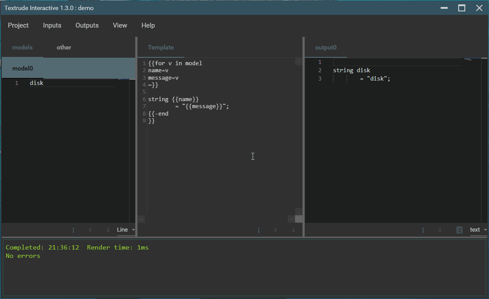

# 

 

## Give a Star! :star:

If you like or are using this project please give it a star or leave some feedback in the [discussions](https://github.com/NeilMacMullen/Textrude/discussions/categories/send-a-smile) section. A little feedback goes a long way - thanks!

## What is it?

Textrude is a cross-platform general-purpose code-generation tool.  It can easily import data from CSV,YAML, JSON  or plain-text files and apply [Scriban](https://github.com/scriban/scriban) templates to quickly scaffold output files. 

Textrude comes in 3 flavours:
- **textrude.exe** is a Windows CLI tool for use from the console and within build-systems
- **textrude_linux** as above but for Linux
- **TextrudeInteractive** is a Windows UI tool for rapid prototyping and development of models and templates.

## Why use it?

Let's face it, there are any number of code-generation technologies you might consider.  Textrude's strengths are:

- Easy model (data) creation - use CSV for simple lists or YAML/JSON if you need structured data
- Low-ceremony syntax while retaining a fully functional programming language
- Supports multiple input models and multiple output files for a single template
- Easy to inject additional model context via environment variables or user-supplied definitions
- Built-in dependency checking integrates well with your build system
- Allows template re-use via include mechanism
- Real-time prototyping tool  (TextrudeInteractive)

## Download/build

The current release is **v1.4.0**.

**Textrude requires [.Net 5.0](https://dotnet.microsoft.com/download/dotnet/5.0).  If it's not already on your machine you will be prompted to install it.**

**To run TextrudeInteractive v1.3 and up you must install the [WebView2 runtime](https://developer.microsoft.com/en-us/microsoft-edge/webview2/)**

 - If you just want the binaries,  [go here](doc/getBinaries.md).

 - Alternatively, [building from source](doc/buildFromSource.md) is pretty easy and gives you access to the bleeding-edge! 
  
 - Or you can create a [Docker image](Docker.md)

## What's new

### vNext (source only)
- Add some [syntactic sugar](doc/syntaxExtensions.md) 
- Provide [create_library](doc/userLibrary.md) method for improved library creation 
- LoopLimit now removed and cancellation for long-running in-flight renders is supported
- textrude.exe can now read models from STDIN or from a URL.  See [this doc](doc/buildSystemIntegration.md)
- textrude.exe model/output specifiers can now include explicit format declaration

### v1.4.0 (source/binary)
- The Monaco text editor is now used for all edit panes including the template editor, definitions and include paths.
- A single Monaco edit pane is now used for multiple models/outputs for cleaner switching & improved responsiveness
- The view menu allows visible-whitespace to be toggled on and off
- Rudimentary syntax highlighting and intellisense are provided for the template editor
- Models and outputs can now be assigned names
- Help menu now includes a link to gitter-chat
- Model, template and output panes now support linking to files.
- Export/Build... menu now brings up a dialog to help build CLI options.
- Updated to latest Scriban for [multi-line pipes](https://github.com/scriban/scriban/pull/327)
- Special thanks to [Martin Hochstrasser](https://github.com/highstreeto) for
  - CAKE build support 
  - The fancy new logo! 
  

[Full change history](doc/changeHistory.md)

## Documentation

- [Getting started with template generation](doc/gettingStarted.md)
- [Extended Scriban syntax](doc/syntaxExtensions.md)  
- [Built in helpers](doc/builtIns.md)
- [Library functions](doc/lib.md)
- [Environment variables and user-definitions](doc/environmentAndDefinitions.md)
- [Multiple models and/or output files](doc/multiModel.md)
- [Creating and using library functions](doc/userlibrary.md)
- [Using Textrude in a build system](doc/buildSystemIntegration.md)
- [Docker image](Docker.md)
- [Understanding file-linkages](doc/fileLinkage.md)
- [Constructing command lines](doc/exportInvocation.md)

## Credits and contributors
Textrude makes heavy use of the following components:
- [Scriban](https://github.com/scriban/scriban) as the template language engine
- [CommandLineParser](https://github.com/commandlineparser/commandline) for command-line parsing
- [CsvHelper](https://github.com/JoshClose/CsvHelper) for CSV deserialisation
- [YamlDotNet](https://github.com/aaubry/YamlDotNet) for YAML deserialisation
- [Json.Net](https://www.newtonsoft.com/json) for Json deserialisation
- [Humanizr](https://github.com/Humanizr/Humanizer) for useful text-processing
- [MaterialDesignToolkit](https://github.com/MaterialDesignInXAML/MaterialDesignInXamlToolkit),   [MaterialDesignExtensions](https://spiegelp.github.io/MaterialDesignExtensions) and [Ookii Dialogs](https://github.com/augustoproiete/ookii-dialogs-wpf)to make the UI a bit less clunky

Huge thanks to the contributors:
- [Martin Hochstrasser](https://github.com/highstreeto) - Docker support, general build enhancements and integration of the Monaco editor
- [Neil MacMullen](https://github.com/NeilMacMullen) - original application concept and implementation

## Help wanted 

If you fancy making Textrude better, I'd be happy to have help! Grab something from the issues list or suggest an idea. Alternatively you can contribute script snippets, improve the documentation or spread the word by writing an article!

## What's with the name 

It's short for Text-extrude but if you can't stop seeing it as Text-Rude you are not alone.

It is unrelated to both the rather cool (but apparently abandoned project) [Textruder](https://github.com/arrogantrobot/textruder) and the plastics company [Tex-Trude](http://www.tex-trude.com/)

